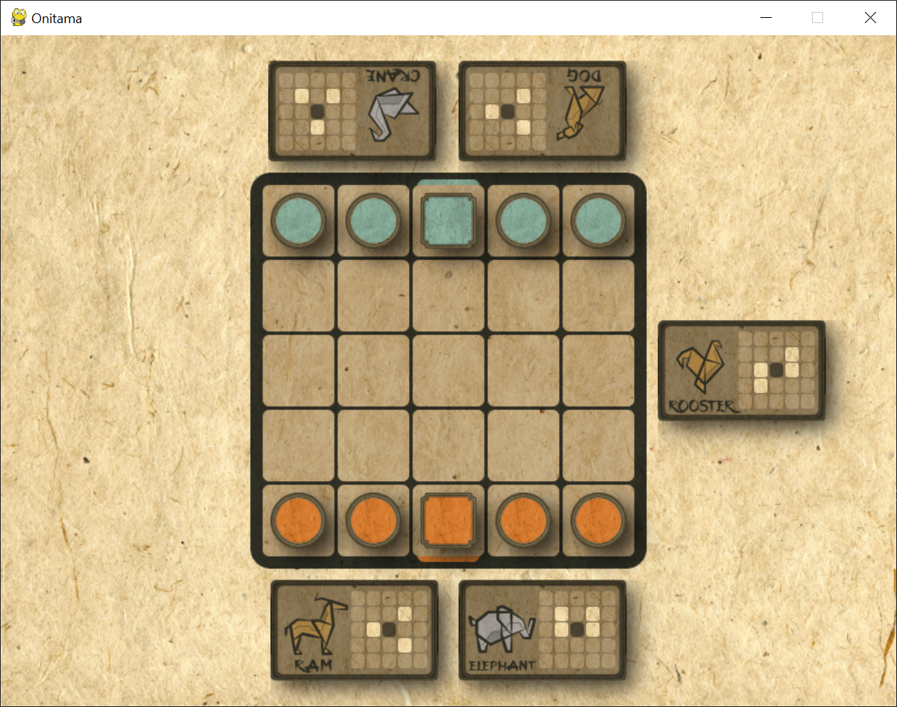

# Onitama
A digital implementation of the chess-like board game Onitama with an AI opponent.

Onitama is a simple game with very rewarding depth. Rules for how to play the game can be found [here](https://www.ultraboardgames.com/onitama/game-rules.php).

## Display
Run main.py in the terminal and it will print out an initial board state similar to the 
following:

## Input
Click a pawn and one of your cards to visualize the possible movements for that combination.

## The Blue Opponent
The AI opponent uses a depth-limited minimax algorithm with alpha-beta pruning. At the moment it runs to a depth of 4 and uses a relatively simple heuristic function to evaluate the board at that depth limit. My plan for developing this
project further is to make better evaluation functions, test them by playing bots against each other, and maybe include different playstyles as options for setting
up a game.

## Dependencies and Sources
This game needs pygame to run, which can be found [here](https://www.pygame.org/wiki/GettingStarted).

Origami animal icons made by [iconfield](https://www.flaticon.com/packs/origami-112).

Inspiration for the textures is from Bill Mudron's [work](https://www.flickr.com/photos/mudron/8306408148/).
